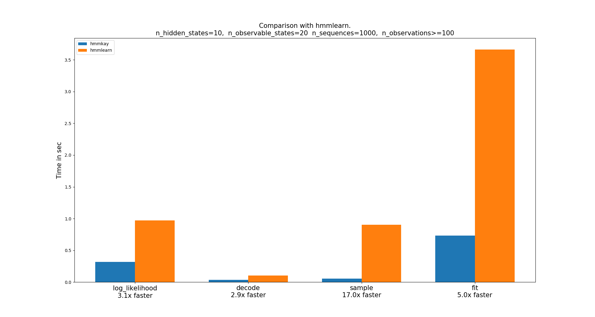

# Hmmkay [](https://travis-ci.org/NicolasHug/hmmkay) [](https://hmmkay.readthedocs.io/en/latest/?badge=latest) [](https://github.com/NicolasHug/hmmkay)

🤔👌

Discrete Hidden Markov Models with Numba


Hmmkay is a basic library for discrete Hidden Markov Models that relies on
numba's just-in-time compilation. It supports decoding, likelihood scoring,
fitting (parameter estimation), and sampling.

Hmmkay accepts sequences of arbitrary length, e.g. 2d numpy arrays or lists
of iterables. Hmmkay internally converts lists of iterables into Numba typed
lists of numpy arrays.

## Installation

    pip install hmmkay

Requires Python 3.6 or higher.

## Examples

Scoring and decoding:

```py
>>> from hmmkay.utils import make_proba_matrices
>>> from hmmkay import HMM

>>> init_probas, transition_probas, emission_probas = make_proba_matrices(
...    n_hidden_states=2,
...    n_observable_states=4,
...    random_state=0
... )
>>> hmm = HMM(init_probas, transition_probas, emission_probas)

>>> sequences = [[0, 1, 2, 3], [0, 2]]
>>> hmm.log_likelihood(sequences)
-8.336
>>> hmm.decode(sequences)  # most likely sequences of hidden states
[array([1, 0, 0, 1], dtype=int32), array([1, 0], dtype=int32)]
```

Fitting:

```py
>>> from hmmkay.utils import make_observation_sequences
>>> sequences = make_observation_sequences(n_seq=100, n_observable_states=4, random_state=0)
>>> hmm.fit(sequences)
```

Sampling:

```py
>>> hmm.sample(n_obs=2, n_seq=3)  # return sequences of hidden and observable states
(array([[0, 1],
        [1, 1],
        [0, 0]]), array([[0, 2],
        [2, 3],
        [0, 0]]))
```

## Documentation

Docs are online at
[https://hmmkay.readthedocs.io/en/latest/](https://hmmkay.readthedocs.io/en/latest/)

## Benchmark

It should be faster than [hmmlearn](https://hmmlearn.readthedocs.io/en/latest/). Here's the result of the `benchmark.py` script on my laptop:

[](https://github.com/NicolasHug/hmmkay) 

## Status

Highly experimental, API subjet to change without deprecation.

I might maintain and develop the package more if people like / use it.

## Development

The following packages are required for testing:

    pip install pytest hmmlearn scipy

For benchmarks:

    pip install matplotlib hmmlearn

For docs:

    pip install sphinx sphinx_rtd_theme


For development, use [pre-commit
hooks](https://ljvmiranda921.github.io/notebook/2018/06/21/precommits-using-black-and-flake8/)
for black and flake8.
